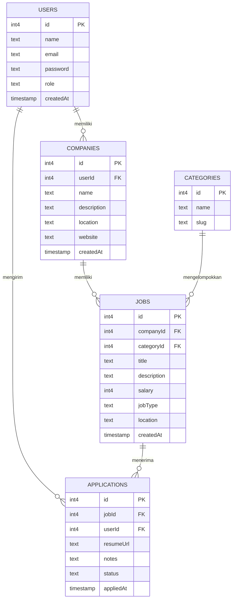

# JobNest

JobNest adalah aplikasi full-stack untuk membantu pengguna mengelola informasi lowongan pekerjaan dan proses lamaran kerja dalam satu tempat. Pengguna dapat melihat lowongan, perusahaan, kategori pekerjaan, serta mencatat lamaran yang telah dikirim beserta statusnya.

Project ini dibuat sebagai **Tugas Akhir Learning Labs: Backend Development** dengan fokus pada perancangan database relasional, pembuatan REST API, implementasi CRUD, deployment, dan dokumentasi API.

## Link Project

- **Repository GitHub:** https://github.com/FarrelDaniel15/jobnest-fullstack
- **Website / Deployment:** https://jobnest-fullstack.vercel.app/

---

# 1. Deskripsi Project

JobNest dibuat sebagai solusi untuk pengguna yang melamar pekerjaan melalui berbagai lowongan tetapi kesulitan mengingat dan mengelola seluruh lamaran tersebut.

Melalui JobNest, data pekerjaan disusun secara terstruktur berdasarkan perusahaan dan kategori pekerjaan. Pengguna juga dapat menyimpan data lamaran, resume, catatan, serta status dari setiap proses lamaran.

Project ini menggunakan database relasional sehingga setiap data tidak berdiri sendiri, tetapi saling terhubung melalui **primary key** dan **foreign key**.

---

# 2. Fitur

Beberapa fitur utama JobNest meliputi:

- Manajemen pengguna.
- Manajemen perusahaan.
- Manajemen kategori pekerjaan.
- Manajemen lowongan pekerjaan.
- Manajemen lamaran pekerjaan.
- Pencatatan status lamaran.
- Penyimpanan URL resume.
- Penyimpanan catatan pada lamaran.
- REST API dengan method `GET`, `POST`, `PUT/PATCH`, dan `DELETE`.
- Database relasional dengan lima tabel yang saling berhubungan.
- Deployment aplikasi secara online menggunakan Vercel.

---

# 3. Teknologi yang Digunakan

- **Frontend:** Full-stack web application
- **Backend:** REST API
- **Database:** Relational SQL Database
- **Deployment:** Vercel
- **API Testing:** Postman / Thunder Client

---

# 4. Skema Database

JobNest memiliki **5 tabel utama** yang saling berhubungan:

1. `users`
2. `companies`
3. `categories`
4. `jobs`
5. `applications`

Skema berikut merupakan representasi langsung dari struktur database pada project JobNest.

## ERD (Entity Relationship Diagram)



> **Catatan:** Diagram di atas ditulis langsung di dalam `README.md` menggunakan Mermaid, sehingga tidak memerlukan file gambar ERD terpisah. Pada GitHub, diagram akan ditampilkan sebagai ERD ketika Mermaid didukung oleh halaman README.

## Struktur Tabel

### `users`

| Kolom | Tipe | Keterangan |
|---|---|---|
| `id` | `int4` | Primary key |
| `name` | `text` | Nama pengguna |
| `email` | `text` | Email pengguna |
| `password` | `text` | Data autentikasi pengguna |
| `role` | `text` | Role pengguna |
| `createdAt` | `timestamp` | Waktu pembuatan akun |

### `companies`

| Kolom | Tipe | Keterangan |
|---|---|---|
| `id` | `int4` | Primary key |
| `userId` | `int4` | Foreign key ke `users.id` |
| `name` | `text` | Nama perusahaan |
| `description` | `text` | Deskripsi perusahaan |
| `location` | `text` | Lokasi perusahaan |
| `website` | `text` | Website perusahaan |
| `createdAt` | `timestamp` | Waktu data dibuat |

### `categories`

| Kolom | Tipe | Keterangan |
|---|---|---|
| `id` | `int4` | Primary key |
| `name` | `text` | Nama kategori |
| `slug` | `text` | Slug kategori |

### `jobs`

| Kolom | Tipe | Keterangan |
|---|---|---|
| `id` | `int4` | Primary key |
| `companyId` | `int4` | Foreign key ke `companies.id` |
| `categoryId` | `int4` | Foreign key ke `categories.id` |
| `title` | `text` | Judul lowongan |
| `description` | `text` | Deskripsi pekerjaan |
| `salary` | `int4` | Gaji |
| `jobType` | `text` | Jenis pekerjaan |
| `location` | `text` | Lokasi pekerjaan |
| `createdAt` | `timestamp` | Waktu lowongan dibuat |

### `applications`

| Kolom | Tipe | Keterangan |
|---|---|---|
| `id` | `int4` | Primary key |
| `jobId` | `int4` | Foreign key ke `jobs.id` |
| `userId` | `int4` | Foreign key ke `users.id` |
| `resumeUrl` | `text` | URL resume |
| `notes` | `text` | Catatan lamaran |
| `status` | `text` | Status lamaran |
| `appliedAt` | `timestamp` | Waktu lamaran dikirim |

## Relasi Antar Tabel

Relasi yang digunakan dalam database JobNest adalah:

- Satu **user** dapat memiliki banyak **company**.
- Satu **user** dapat membuat banyak **application**.
- Satu **company** dapat memiliki banyak **job**.
- Satu **category** dapat memiliki banyak **job**.
- Satu **job** dapat memiliki banyak **application**.
- Setiap **application** terhubung dengan satu `user` dan satu `job`.

Dengan demikian, database memenuhi ketentuan database relasional dengan minimal lima tabel dan relasi menggunakan foreign key.

---

# 5. REST API

JobNest menggunakan konsep **REST API** untuk melakukan komunikasi dan manipulasi data.

Method HTTP yang digunakan:

| Method | Fungsi |
|---|---|
| `GET` | Mengambil data |
| `POST` | Menambahkan data |
| `PUT/PATCH` | Mengubah data |
| `DELETE` | Menghapus data |

Format request dan response menggunakan **JSON**.

## Base URL

```text
https://jobnest-fullstack.vercel.app
```

Header untuk request JSON:

```http
Content-Type: application/json
```

> **Penting:** URL endpoint pada bagian berikut harus disesuaikan dengan route API yang benar-benar terdapat pada source code project. Dokumentasi di bawah menggunakan format REST sebagai struktur dokumentasi.

---

# 6. Dokumentasi Endpoint

## Jobs

### GET - Mengambil Semua Job

- **Method:** `GET`
- **URL:** `https://jobnest-fullstack.vercel.app/api/jobs`
- **Deskripsi:** Mengambil seluruh data lowongan pekerjaan.

### Response Sukses `200 OK`

```json
{
  "data": [
    {
      "id": 1,
      "title": "Software Engineer",
      "description": "Lowongan Software Engineer",
      "salary": 10000000,
      "jobType": "Full-time",
      "location": "Jakarta"
    }
  ]
}
```

### Response Error `500`

```json
{
  "error": "Internal server error"
}
```

---

## GET - Mengambil Job Berdasarkan ID

- **Method:** `GET`
- **URL:** `https://jobnest-fullstack.vercel.app/api/jobs/1`
- **Deskripsi:** Mengambil satu data job berdasarkan ID.

### Response Sukses `200 OK`

```json
{
  "data": {
    "id": 1,
    "title": "Software Engineer",
    "description": "Lowongan Software Engineer",
    "salary": 10000000,
    "jobType": "Full-time",
    "location": "Jakarta"
  }
}
```

### Response Error `404`

```json
{
  "error": "Job tidak ditemukan"
}
```

---

## POST - Menambahkan Job

- **Method:** `POST`
- **URL:** `https://jobnest-fullstack.vercel.app/api/jobs`
- **Deskripsi:** Menambahkan lowongan pekerjaan baru.
- **Headers:** `Content-Type: application/json`

### Request Body

```json
{
  "companyId": 1,
  "categoryId": 1,
  "title": "Software Engineer",
  "description": "Lowongan Software Engineer",
  "salary": 10000000,
  "jobType": "Full-time",
  "location": "Jakarta"
}
```

### Response Sukses `201 Created`

```json
{
  "message": "Job berhasil ditambahkan",
  "data": {
    "id": 1,
    "title": "Software Engineer"
  }
}
```

### Response Error `400`

```json
{
  "error": "Field wajib diisi"
}
```

---

## PUT/PATCH - Mengubah Job

- **Method:** `PUT` atau `PATCH`
- **URL:** `https://jobnest-fullstack.vercel.app/api/jobs/1`
- **Deskripsi:** Mengubah data lowongan pekerjaan.

### Request Body

```json
{
  "title": "Senior Software Engineer",
  "salary": 15000000,
  "location": "Jakarta"
}
```

### Response Sukses `200 OK`

```json
{
  "message": "Job berhasil diperbarui",
  "data": {
    "id": 1,
    "title": "Senior Software Engineer"
  }
}
```

### Response Error `404`

```json
{
  "error": "Job tidak ditemukan"
}
```

---

## DELETE - Menghapus Job

- **Method:** `DELETE`
- **URL:** `https://jobnest-fullstack.vercel.app/api/jobs/1`
- **Deskripsi:** Menghapus lowongan pekerjaan berdasarkan ID.

### Response Sukses `200 OK`

```json
{
  "message": "Job berhasil dihapus"
}
```

### Response Error `404`

```json
{
  "error": "Job tidak ditemukan"
}
```

---

# 7. Resource Database Lainnya

Selain `jobs`, database JobNest memiliki resource:

- `users`
- `companies`
- `categories`
- `applications`

Endpoint untuk resource tersebut harus mengikuti route yang benar-benar tersedia pada source code.

Format dokumentasinya:

```text
GET     /resource
GET     /resource/:id
POST    /resource
PUT     /resource/:id
PATCH   /resource/:id
DELETE  /resource/:id
```

Tidak semua method harus digunakan pada setiap resource. Yang harus dipastikan adalah project memiliki minimal satu resource utama dengan operasi **CRUD lengkap**.

---

# 8. HTTP Status Code

JobNest menggunakan HTTP status code untuk menunjukkan hasil dari request.

| Status Code | Keterangan |
|---|---|
| `200 OK` | Request berhasil |
| `201 Created` | Data berhasil dibuat |
| `400 Bad Request` | Data request tidak valid |
| `401 Unauthorized` | Pengguna belum terautentikasi |
| `403 Forbidden` | Pengguna tidak memiliki izin |
| `404 Not Found` | Data tidak ditemukan |
| `500 Internal Server Error` | Terjadi kesalahan pada server |

---

# 9. Deployment

JobNest telah di-deploy menggunakan **Vercel** sehingga dapat diakses secara publik.

### URL Deployment

https://jobnest-fullstack.vercel.app/

API yang diuji melalui Postman atau Thunder Client harus menggunakan URL deployment tersebut, bukan hanya URL `localhost`.

Database yang digunakan untuk aplikasi juga harus dapat diakses oleh aplikasi yang telah di-deploy.

Data sensitif seperti password database, API key, dan secret key tidak boleh ditulis langsung di source code. Data tersebut harus disimpan menggunakan **Environment Variables**.

---

# 10. Pengujian API

Pengujian API dapat dilakukan menggunakan:

- Postman
- Thunder Client

Pengujian dilakukan dengan menggunakan URL deployment:

```text
https://jobnest-fullstack.vercel.app/
```

Minimal pengujian harus mencakup:

```text
GET
POST
PUT/PATCH
DELETE
```

Bukti pengujian dapat berupa:

- Screenshot request dan response dari Postman/Thunder Client, atau
- Export collection dalam bentuk file `.json`.

Untuk dokumentasi tugas akhir, setiap endpoint yang digunakan sebaiknya memiliki bukti request dan response.

---

# 11. Cara Menjalankan Project Secara Lokal

## Clone Repository

```bash
git clone https://github.com/FarrelDaniel15/jobnest-fullstack.git
cd jobnest-fullstack
```

## Install Dependencies

Gunakan package manager yang digunakan oleh project.

Contoh jika project menggunakan npm:

```bash
npm install
```

## Environment Variables

Buat file `.env` dan isi environment variable yang dibutuhkan oleh project.

Contoh:

```env
DATABASE_URL=your_database_connection_string
```

Jangan memasukkan file `.env` ke repository GitHub.

## Menjalankan Development Server

Jika project menggunakan npm:

```bash
npm run dev
```

Kemudian buka URL yang diberikan oleh development server.

---

# 12. Checklist Tugas Akhir

| Requirement | Status |
|---|---|
| Minimal 5 tabel database | ✅ |
| Setiap tabel memiliki primary key | ✅ |
| Terdapat foreign key | ✅ |
| Terdapat relasi antar tabel | ✅ |
| ERD / skema database tersedia | ✅ |
| Method GET | ✅ |
| Method POST | ✅ |
| Method PUT/PATCH | ✅ |
| Method DELETE | ✅ |
| Format JSON | ✅ |
| HTTP status code | ✅ |
| Pesan error yang jelas | ✅ |
| Deployment ke Vercel | ✅ |
| Dapat diuji melalui Postman/Thunder Client | ✅ |
| Dokumentasi endpoint | ✅ |
| Dokumentasi cara menjalankan project | ✅ |
| Bukti pengujian setiap endpoint | ✅ |
| Password/secret key tidak disimpan di repository | ✅ |

---

# 13. Pengumpulan

### Repository GitHub

https://github.com/FarrelDaniel15/jobnest-fullstack

### Deployment Vercel

https://jobnest-fullstack.vercel.app/

### Database

JobNest menggunakan lima tabel utama:

```text
users
companies
categories
jobs
applications
```

Kelima tabel tersebut saling berhubungan melalui foreign key dan digunakan untuk mengelola pengguna, perusahaan, kategori pekerjaan, lowongan, dan lamaran pekerjaan.

---

# 14. Kesimpulan

JobNest merupakan aplikasi full-stack yang dibuat untuk membantu pengelolaan lowongan dan lamaran pekerjaan secara terstruktur. Dari sisi backend, project ini menerapkan database relasional dengan lima tabel yang saling berhubungan, REST API dengan berbagai HTTP method, operasi CRUD, serta deployment ke Vercel.

Project ini dibuat untuk memenuhi kebutuhan **Tugas Akhir Learning Labs: Backend Development**, khususnya dalam aspek perancangan database, implementasi API, deployment, pengujian, dan dokumentasi.
